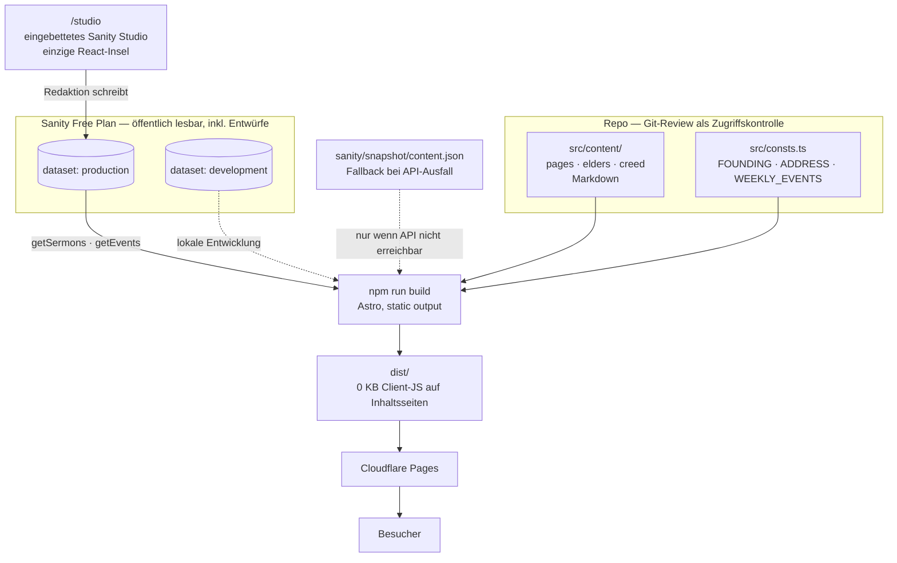

# arche-bremen-website

Website der Gemeindegründung Arche Bremen. Architektur und harte Regeln stehen
in [`CLAUDE.md`](./CLAUDE.md) — vor jeder Änderung lesen.

## Voraussetzungen

- Node-Version aus `.nvmrc` (aktuell 24): `nvm use`
- Ein Sanity-Projekt mit zwei Datasets: `production` und `development`

## Setup

```sh
nvm use
npm ci
cp .env.example .env.local
# .env.local mit echten Werten füllen, siehe unten
```

## Umgebungsvariablen

Definiert in `.env.local` (nie committen — steht in `.gitignore`).
`.env.example` dokumentiert die Variablen mit leeren Werten.

| Variable | Bedeutung |
|---|---|
| `SANITY_PROJECT_ID` | Projekt-ID aus [sanity.io/manage](https://sanity.io/manage) |
| `SANITY_DATASET` | `development` für lokale Arbeit, `production` ist dem Deployment vorbehalten |

**Wichtig:** Mit `SANITY_DATASET=production` bearbeitet das lokale Studio die
echten Live-Inhalte. Für die tägliche Arbeit immer `development` verwenden.

## Lokaler Start

```sh
npm run dev
```

Startet Astros Dev-Server. Das Sanity Studio ist dabei unter `/studio`
erreichbar und bearbeitet das in `SANITY_DATASET` konfigurierte Dataset.

```sh
npm run build    # statischer Build nach dist/
npm run preview  # Vorschau des Builds
```

## Architektur



Seltene, heikle Inhalte (Bekenntnis, Profile, Impressum) liegen im Repo und
laufen über Git-Review. Häufige, unkritische Inhalte (Predigten, Termine)
liegen in Sanity und sind für Redakteure ohne Git pflegbar. Begründung der
Grenze: `CLAUDE.md`, Abschnitt „Content-Split — die zentrale
Architekturentscheidung".

## Beispieldaten für `development`

```sh
npx sanity login              # einmalig
npm run seed:development
```

Importiert `sanity/seed/development.ndjson` (20 Beispielpredigten, neun
Beispieltermine) fest in das Dataset `development` — das Zielname steht im
npm-Skript, nicht in `SANITY_DATASET`, damit ein falsch gesetzter Wert nie
versehentlich `production` überschreibt. `--replace` ersetzt nur Dokumente
mit gleicher `_id`, leert das Dataset nicht.

Zwei der Beispieltermine liegen absichtlich in der Vergangenheit und
erscheinen deshalb nicht auf der Startseite (`getEvents()` filtert auf
`start >= now()`) — sie testen genau diesen Fall. Die künftigen Termine sind
fest datiert bis Sommer 2027; danach im Seed neue nachtragen. Ein weiterer
Termin (`event-beispiel-ausfall-gottesdienst`) hat `cancelled: true` gesetzt
und testet den Hinweisblock für ausgefallene Termine — zugleich das Muster,
wie ein einmaliger Ausfall eines wöchentlichen Fixtermins (`WEEKLY_EVENTS` in
`src/consts.ts`) abgebildet wird: als normaler Sanity-Termin mit dem
passenden Datum und gesetztem Häkchen, nicht als eigenes Konzept.

Free-Datasets sind öffentlich lesbar (siehe CLAUDE.md) — deshalb im Seed keine
personenbezogenen Daten außer dem Namen, den das Freitextfeld `preacher` bei
`sermon` ohnehin vorsieht.

## Datenmodell

Details und Begründung in `CLAUDE.md`, Abschnitt "Datenmodell (Sanity)".
Kurzreferenz:

### Sanity (`sanity/schemaTypes/`)

| Typ | Felder | Datei |
|---|---|---|
| `sermon` | title, slug*, date, preacher (Freitext), series, passages[], audioUrl/audioFile, description | `sermon.ts` |
| `event` | title, start, end, location, description, cancelled | `event.ts` |

\* Abweichung vom Datenmodell in `CLAUDE.md`: `sermon.slug` ist hier Pflicht,
weil ohne Slug keine Detailseite unter `/predigten/<slug>` erreichbar wäre.

Die 66 Bibelbücher stehen fest in `sanity/bibleBooks.ts` — niemals als
Freitext im Schema, sonst ist Filterbarkeit dauerhaft zerstört.

### Repo (`src/content/`, Astro Content Collections)

| Collection | Zweck | Beispiel |
|---|---|---|
| `pages` | Statische Seiten (Impressum, Datenschutz, später Vision etc.) | `src/content/pages/impressum.md` |
| `elders` | Profile der Ältesten (Gemeindeleitung), inkl. optionalem Foto (`photo`) | `src/content/elders/niklas-meyer.md` |
| `creed` | Die 25 Artikel des Glaubensbekenntnisses, dazu Vorwort und Quelle — eine Datei pro Artikel, siehe `/glaubensbekenntnis` | `src/content/creed/01-die-heilige-schrift.md` |

Verknüpfung: `sermon.preacher` ist reiner Freitext in Sanity. Stimmt der Name
(Groß-/Kleinschreibung und Leerzeichen egal) mit `name` in einem
Markdown-Profil unter `src/content/elders/` überein, verlinkt die Website
automatisch dorthin. Gibt es keine Übereinstimmung (z.B. Gastprediger ohne
Ältestenamt, oder ein Tippfehler), wird nur der Name als Text angezeigt, ohne
Link und ohne Fehler. Die verknüpften Profile erscheinen unter `/aelteste`.

### Such-/Filterleiste unter `/predigten`

`SermonFilter.astro` rendert ein Suchfeld sowie Pill-Gruppen für Bibelbuch,
Prediger und Predigtreihe — bewusst kein `<select>`: Die Predigtenseite
verwendet keine Dropdowns (siehe CLAUDE.md). Jede Pill ist ein `<label>` um
ein versteckt gestyltes Radio (`.visually-hidden`), gruppiert in einem
`<fieldset>` pro Dimension; der Wrapper ist dafür ein `<form>`. Die
Optionslisten kommen immer aus dem tatsächlichen Bestand, nie aus einer
festen Liste. Die Filterdaten selbst (Suchindex, Bibelbuch-Schlüssel,
Prediger, Reihe) stehen als `data-*`-Attribute an jeder Kachel in
`SermonCard.astro`. Ein kleines Vanilla-Skript (kein Framework, siehe
CLAUDE.md Regel 4) liest die Radio-Gruppen über
`form.elements.namedItem(name)` (liefert eine `RadioNodeList`, deren
`.value` sich wie bei einem `<select>` lesen und setzen lässt) und blendet
Kacheln beim Filtern per `hidden` ein und aus — alle bleiben dabei
server-gerendert im HTML.

`src/lib/search.ts` exportiert `normalizeSearch()` (Kleinschreibung +
Diakritika-Entfernung) und wird sowohl beim Bauen des Suchindex
(`SermonCard.astro`, Server) als auch im Browser-Skript
(`SermonFilter.astro`) verwendet — eine Funktion statt zweier Kopien, die
auseinanderlaufen könnten.

Ohne JavaScript bleibt die Filterleiste unsichtbar (`hidden`-Attribut wird
nur per Skript entfernt) und die komplette chronologische Liste sichtbar —
Progressive Enhancement, keine Funktionseinbuße.

Der Übergang beim Filtern läuft weich statt abrupt: das Skript kapselt jede
Filteränderung in `document.startViewTransition`, jede Kachel trägt dazu
einen `view-transition-name` (`SermonCard.astro`) — verbleibende Kacheln
gleiten so in ihre neue Rasterposition statt zu springen. Ohne
Browser-Unterstützung oder bei `prefers-reduced-motion: reduce` schaltet die
Liste stattdessen sofort um, wie vor dieser Änderung. Details und
Abwägungen in `DESIGN.md`, Abschnitt „Bewegung".

### Offline-Fallback für Sanity

`src/lib/sanity.ts` fällt zurück auf `sanity/snapshot/content.json`, wenn die
Sanity-API zur Buildzeit nicht erreichbar ist — sonst würde ein Sanity-Ausfall
jeden Build hart brechen. Die Datei wird committed und mit

```sh
npm run snapshot              # Dataset production (Vorgabe)
npm run snapshot development  # oder ein anderes Dataset
```

aus `scripts/snapshot.mjs` erzeugt. Nach jeder inhaltlichen Änderung, die
online bleiben soll, falls Sanity mal nicht erreichbar ist, neu ausführen und
committen — der Snapshot altert, ein Build während eines Ausfalls
veröffentlicht genau den Stand von dessen letzter Erzeugung. Ohne die Datei
bricht der Build wie zuvor hart ab; ein leerer Predigtbereich wäre schlimmer
als ein roter Build.

Die GROQ-Projektion steht bewusst doppelt — in `scripts/snapshot.mjs` und
`src/lib/sanity.ts`. Ändert sich eine, die andere nachziehen (beide Dateien
verweisen aufeinander).

### QR-Code neu erzeugen

Die Spendenseite (`src/content/pages/spenden.md`) bindet `public/spenden-qr.svg`
ein — einen GiroCode (EPC-QR-Code) mit vorausgefüllter Überweisung an Empfänger,
IBAN und Verwendungszweck „Arche Bremen". Erzeugt und committed, kein Build-Schritt:

```sh
npm run girocode
```

Nötig nach jeder Änderung von IBAN, Empfänger oder Verwendungszweck in
`scripts/girocode.mjs` — dieselben Werte stehen zusätzlich als Text in
`src/content/pages/spenden.md` und `src/content/pages/impressum.md` und müssen
von Hand mitgezogen werden (bewusst dupliziert, siehe dortige Kommentare). Der
vollständige Payload steht zur Kontrolle auch als Kommentar im Kopf der
erzeugten SVG-Datei.

**Nach jedem Lauf: den neuen Code mit einer echten Banking-App scannen**, bevor
der Commit rausgeht. Ein stillschweigend falscher Verwendungszweck fällt sonst
erst auf, wenn eine Spende nicht bei Bremen ankommt. Details und
Design-Begründung in `DESIGN.md`, Abschnitt „QR-Code (GiroCode)".

### Wie ein neuer Dokumenttyp entsteht (Sanity)

1. Neue Datei unter `sanity/schemaTypes/`, `defineType` verwenden (siehe
   bestehende Typen als Vorlage).
2. In `sanity/schemaTypes/index.ts` in `schemaTypes` aufnehmen.
3. Bei Bedarf eine Fetch-Funktion in `src/lib/sanity.ts` ergänzen und eine
   Route unter `src/pages/` anlegen.

### Wie eine neue statische Repo-Seite entsteht

1. Markdown-Datei unter `src/content/pages/<slug>.md` mit Frontmatter
   `title` (und optional `description`) anlegen.
2. Fertig — `src/pages/[slug].astro` rendert sie automatisch unter `/<slug>`.

**Achtung bei Bibelstellen:** Beginnt eine Zeile mit einer Ziffer gefolgt von
einem Punkt und Leerzeichen (etwa `1. Korinther 9,22` oder `2. Timotheus
3,16`), liest Markdown das als numerierte Liste und reißt den Absatz auf —
und zwar bei **jeder** Ziffer, nicht nur bei `1`. In solchen Fällen den Punkt
maskieren: `1\. Korinther`, `2\. Timotheus`. Das betrifft auch
Fußnotendefinitionen im Glaubensbekenntnis (siehe unten) — `[^12-4]: 2.
Timotheus 3,16` rendert sonst als eigene Liste innerhalb der Fußnote statt
als Text. Nach dem Neuumbrechen einer Datei mit
`grep -n '^\[\^[^]]*\]: [0-9]\+\. \|^[0-9]\+\. ' src/content/pages/*.md src/content/creed/*.md`
prüfen — der Befehl muss leer bleiben.

### Wie ein Foto zu einem Ältesten-Profil hinzukommt

`elders.photo` ist optional — ohne Foto bleibt die Kachel wie bisher rein
typografisch (siehe DESIGN.md, Abschnitt „Bildwelt"). Zum Hinzufügen:

1. Foto neben die passende Markdown-Datei legen, gleicher Basename, z. B.
   `src/content/elders/niklas-meyer.jpg`.
2. Im Frontmatter ergänzen: `photo: ./niklas-meyer.jpg`.
3. Anforderung an die Datei: Hochformat (Zuschnitt 4:5), mindestens 1200 px
   breit, JPEG. Astro erzeugt daraus beim Build automatisch die WebP-Varianten
   für Kachel und Detailseite.

`niklas-meyer.jpg` unterschreitet diese Vorgabe bewusst (640×960 px, 2:3, keine
höher aufgelöste Aufnahme vorhanden) — `object-fit: cover` schneidet im Browser
mittig auf 4:5 zu, ohne die Datei zu bearbeiten. Für künftige Fotos bleibt
Schritt 3 die Vorgabe.

### Wie ein Artikel des Glaubensbekenntnisses geändert wird

Jeder Artikel ist eine eigene Datei unter `src/content/creed/<nn>-<slug>.md`
mit Frontmatter `title` und `number` (Vorwort und Quelle haben kein
`number` — sie erscheinen nicht als Kachel). `/glaubensbekenntnis` rendert
die Kacheln sortiert nach `number`, `/glaubensbekenntnis/<slug>` ist die
Detailseite dazu. Einen neuen Artikel einfügen heißt: neue Datei mit der
nächsten Nummer anlegen — die Nummern in den bestehenden Dateinamen und
`title` bleiben davon unberührt (keine automatische Umnummerierung).

**Bibelstellen sind Fußnoten**, GFM-Syntax `[^kennung]` im Fließtext plus
Definitionsblock am Dateiende, je eine pro Zeile in Auftretensreihenfolge.
Astro rendert das ohne zusätzliche Abhängigkeit — `astro.config.mjs` setzt
nur das deutsche Label über `markdown.processor: satteri({ features: {
gfm: { footnotes: { … } } } })`. Zwei Regeln:

- **Kennung immer mit Artikelnummer präfigieren**, `[^12-1]`, `[^12-2]`,
  Vorwort `[^0-1]`. Grund: `/glaubensbekenntnis` rendert alle Artikelkörper
  auf einer Seite (Popover in `CreedCard.astro`), gleiche Kennungen in
  verschiedenen Artikeln erzeugten dort doppelte HTML-IDs und ein Popup
  könnte zur Fußnote eines anderen Artikels springen. Die sichtbare Nummer
  im Text kommt trotzdem aus der Reihenfolge des Auftretens — `[^12-1]`
  erscheint als „1", wenn es der erste Marker im Artikel ist.
- Beginnt eine Definition mit einer Ziffer (`2. Timotheus …`), den Punkt
  maskieren (`2\. Timotheus`) — siehe „Achtung bei Bibelstellen" oben.

Nicht jede Klammer im Original ist eine reine Bibelstelle — Glossen wie
„(Charismen)" oder Artikel-Querverweise wie „(siehe „Wiedergeburt und
wirksame Berufung", Artikel 10)" bleiben im Fließtext stehen.

## Markendateien

`src/assets/brand/` enthält das offizielle Logo als SVG (seit 10. August 2026,
siehe `DESIGN.md`, Abschnitt „Logo"):

- `arche-logo.svg` — vollständiges Lockup, unverändert wie geliefert.
  Eingebunden in Header und Hero.
- `bogen.svg` — nur der Bogen, ein einzelner Pfad aus dem Lockup
  herausgelöst, viewBox auf ihn zugeschnitten. Eingebunden als Stilelement in
  der Termine-Sektion.

Beide als reiner Asset-Import eingebunden (`import x from '.../datei.svg'`,
``), nicht über die
`Image`-Komponente — deren Sharp-Pipeline ist für Rasterbilder gedacht und
verarbeitet Vektorgrafiken nicht sinnvoll.

`public/favicon.svg` (mit `public/favicon.png` als Fallback für ältere
Browser) verwendet denselben Bogen-Pfad wie `bogen.svg`, unverändert, nur per
`transform` auf ein quadratisches 64×64-Format zentriert. Dunkelblau
(`--c-blue-dark`) auf transparentem Grund statt der alten JPEG-Interimslösung
(Bogen weiß auf Schwarz). Details und die bewusste Abweichung von der
Kontrastregel (Sichtbarkeit im Dark-Mode-Tab) in `DESIGN.md`, Abschnitt
„Logo".

`src/assets/brand/og.svg` ist die Quelle für `public/og.png` (Open-Graph-
Vorschaukarte, 1200×630, siehe `BaseLayout.astro`). Bewusst ohne
`<text>`-Element — reine Pfade sind mit jedem Konverter identisch
reproduzierbar, Text hängt an installierten Systemfonts und Jost ist keiner.
Ändert sich das Bild: `og.svg` bearbeiten, dann verlustfrei auf exakt
1200×630 nach `public/og.png` rendern (kein neues Paket in
`package.json` — lokal reicht das bereits im `node_modules`-Baum liegende
`sharp`, z. B. `node -e "require('sharp')('src/assets/brand/og.svg',{density:96}).resize(1200,630).png().toFile('public/og.png')"`),
beide Dateien committen.

Noch offen:

- **Footer** behält die Textwortmarke. Das Lockup ist einfarbig Dunkelblau,
  auf dem dunklen Footer-Hintergrund unlesbar — unabhängig vom Dateiformat.

## Offene Punkte

Diese Punkte sind bewusst nicht Teil des aktuellen Stands:

- **Gründungsphase (`src/consts.ts`):** Es gibt noch keinen öffentlichen
  Gottesdienst — `SERVICE` ist deshalb aktuell entfernt und `WEEKLY_EVENTS`
  leer. Above the fold stehen stattdessen `FOUNDING.claim` und
  `FOUNDING.milestoneDate` (aktuell 1. April 2027). `ADDRESS` ist als
  `PLATZHALTER` markiert (Norderoog 2 ist die voraussichtliche, aber nicht
  bestätigte Adresse) und wird deshalb nirgends gerendert. `PRAYER_REQUESTS`
  enthält Gebetsanliegen für die Startseiten-Sektion „Bete und bau mit"; die
  mit `PLATZHALTER` markierten Einträge sind ein Vorschlag und brauchen
  inhaltliche Freigabe durch das Team. Sobald der erste Gottesdienst feststeht:
  `SERVICE`/`ADDRESS` zurück in den Hero und den Footer, `WEEKLY_EVENTS`
  befüllen, `FOUNDING`/`PRAYER_REQUESTS` aus `index.astro` entfernen. Zum
  selben Zeitpunkt: `index.astro`, JSON-LD um ein `Church`-Objekt
  (`address`, `geo`, `openingHoursSpecification`) ergänzen — bis dahin bleibt
  es bei `WebSite`/`Organization` ohne Adresse (siehe Kommentar dort).
- `CONTACT` ist mit `info@bremen.arche-gemeinde.de` eingerichtet. Die Domain
  der veröffentlichten Seite ist `site` in `astro.config.mjs`
  (`https://bremen.arche-gemeinde.de`) — dort steht sie einmalig, nicht in
  `consts.ts`. Ändert sich die Domain, muss sie zusätzlich in
  `public/robots.txt` (`Sitemap:`-Zeile) nachgezogen werden — die einzige
  Stelle, die sie doppelt hält, weil sie eine statische Datei ohne
  Template-Schicht ist.
- **Impressum:** `/impressum` ist vorhanden, Angaben 1:1 von arche-gemeinde.de
  übernommen. **Juristisch nicht bestätigt** — nur korrekt, wenn Arche Bremen
  rechtlich Teil des Hamburger Vereins ist. Vor dem ersten Deploy von
  fachkundiger Seite prüfen lassen, ebenso Registereintrag und USt-IdNr.
- **Datenschutz:** `/datenschutz` existiert, eigens für diese Seite verfasst
  (nicht von arche-gemeinde.de übernommen — dort werden Dienste beschrieben,
  die es hier nicht gibt). **Juristisch nicht bestätigt**, insbesondere die
  Einschätzung, dass mangels Cookies/Tracking kein Consent-Banner nötig ist.
  Sobald ein Dienst mit Speicherzugriff dazukommt (eingebettete Karte,
  Newsletter, Zahlungsformular auf der eigenen Seite), wird ein
  Consent-Banner Pflicht und diese Erklärung muss erweitert werden.
- **og.png:** Reine Lockup-Karte ohne das Wort „Bremen" — bewusste
  Entscheidung, kein Versehen (Textrendering bräuchte einen Font-Renderer für
  Jost, siehe Abschnitt „Markendateien"). Der Ortsname steht weiterhin im
  `og:image:alt`, Seitentitel und Footer.
- Kalenderansicht, Audio-Player, Über-uns- und Gemeindeleben-Seiten,
  Deployment, Studio-Deploy.

## Änderungen beitragen

- Vor jeder Änderung `CLAUDE.md` lesen — die neun harten Regeln sind
  entschieden, nicht Diskussionsgrundlage.
- Branch pro Änderung, kein Direktcommit auf `main`. Merge über Pull Request,
  damit Cloudflare eine Preview-URL baut und ein zweiter Blick auf
  personenbezogene Inhalte stattfindet.
- Commit-Konvention aus der bisherigen Historie: `feat:`, `fix:`, `content:`,
  `style:`, `refactor:`, `docs:`. Englisch, Imperativ, eine Aussage pro
  Commit.
- Vor dem PR muss `npm run build` durchlaufen. Kein Linter, keine Tests —
  bewusst, siehe Wartbarkeit in `CLAUDE.md`.
- Keine neue Dependency ohne Absprache. `package-lock.json` gehört zum
  Commit.
- Design: Werte nur aus `src/styles/tokens.css`. Fehlt ein Wert, in
  `DESIGN.md` unter „Offene Fragen" ergänzen statt im Komponentencode
  improvisieren.
- Niemals committen: `.env.local`, Tokens, Screenshots mit personenbezogenen
  Daten. Versehentlich gepusht → Zugangsdaten sofort rotieren, nicht nur den
  Commit zurücknehmen.

## Deployment

Noch nicht eingerichtet. Vorgesehen: Cloudflare Pages, Build mit `npm ci` und
`npm run build`. `SANITY_DATASET=production` als Umgebungsvariable im
Hosting-Dashboard setzen (nicht im Repo).

`public/_headers` setzt Cache- und Sicherheits-Header für Cloudflare Pages.
Nach jedem Deploy prüfen, ob Cloudflare die Datei akzeptiert hat (sie wird
bei einem Formatfehler stillschweigend ignoriert):

```sh
curl -sI https://bremen.arche-gemeinde.de/_astro/<eine-datei>.css | grep -i cache-control
curl -sI https://bremen.arche-gemeinde.de/studio | grep -i x-robots-tag
```

**Achtung bei Schriftdateien:** `/fonts/*` ist ein Jahr lang cachebar, weil
die Dateinamen (anders als bei `/_astro/*`) keinen Inhalts-Hash tragen. Wer
eine Schriftdatei austauscht, muss sie umbenennen (z. B. `jost-500-v2.woff2`)
und Preloads (`BaseLayout.astro`) sowie `@font-face` (`global.css`)
anpassen — sonst sehen wiederkehrende Besucher bis zu ein Jahr lang die alte
Datei.
